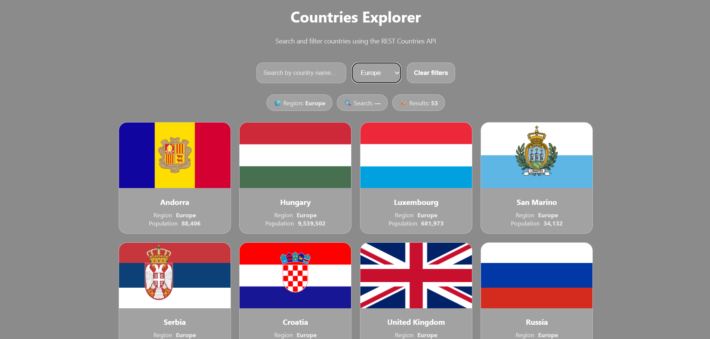

# 🌍 Countries Explorer

A React application that allows users to explore countries around the world using real data from the **REST Countries API**.  
Users can search by country name, filter by region, and view key information such as flags, population, and region.

---

## Features

- Fetches real country data from a public API
- Search countries by name (debounced for performance)
- Filter countries by region
- Displays country flag, name, region, and population
- Handles loading and error states properly
- Modern UI with smooth animations (Framer Motion)

---

## Tech Stack

- React (Vite)
- JavaScript (ES6+)
- REST Countries API
- Framer Motion
- CSS

---

## ▶️ How to Run the Project

1. Clone the repository:
   ```bash
   git clone <your-repo-url>
Navigate into the project folder:

cd countries-explorer
Install dependencies:

npm install
Start the development server:

npm run dev
Open the app in your browser:

http://localhost:5173
🌐 API Endpoints Used
All countries

https://restcountries.com/v3.1/all
Search by country name

https://restcountries.com/v3.1/name/{name}
Filter by region

https://restcountries.com/v3.1/region/{region}

## 🖼️ Screenshots

### Home Page


### Filtered Results


Create a screenshots folder in the project root and place the images there.

