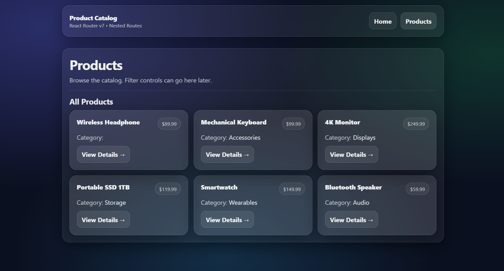
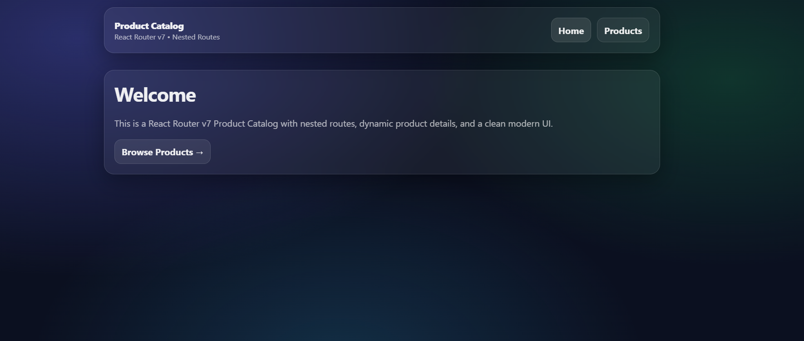

# 🛍️ Week 4 Assignment – React Router v7 Product Catalog

A multi-page Product Catalog built using **React Router v7** demonstrating:
- Nested routes
- Dynamic routes
- Navigation with active styling

---

##  Functional Requirements Implemented

### 1) Routes
- `/` → Home Page
- `/products` → Products Layout + Product List
- `/products/:id` → Product Details (dynamic route)
- `*` → 404 Not Found

### 2) Navigation
- Top navigation bar visible on all pages
- Links: Home, Products
- Uses `NavLink` with active style

### 3) Products Data
- Local array (no API)
- Minimum 6 products
- Each product has: `id`, `name`, `price`, `category`, `description`

### 4) Nested Routes
- `/products` is a layout route (container)
- Shows:
  - Heading
  - Short description / placeholder
  - `<Outlet />` where nested content renders
- Both Product List and Product Details render inside this layout

### 5) Product List Page
- Displays products in a clean grid/list
- Each product has a “View Details” link to `/products/:id`

### 6) Product Details Page
- Reads `id` using `useParams()`
- Displays: name, price, category, description
- Back button uses `useNavigate(-1)`
- Invalid id shows “Product not found” + link to `/products`

---

##  React Router Concepts Used
- `createBrowserRouter`
- `RouterProvider`
- Nested Routes
- `<Outlet />`
- `useParams()`
- `useNavigate()`
- `NavLink`

---

##  Project Structure

src/
components/
Navbar.jsx
pages/
Home.jsx
ProductsLayout.jsx
ProductsList.jsx
ProductDetails.jsx
NotFound.jsx
RootLayout.jsx
data/
products.js
main.jsx


---

---

## 📸 Screenshots

### Products Page


### Home Page


## 🛠️ Run the Project
From this folder:
`week-04/Product-Catalog`

```bash
npm install
npm run dev
👩‍💻 Author

Farzana
GitHub: https://github.com/Farzana921