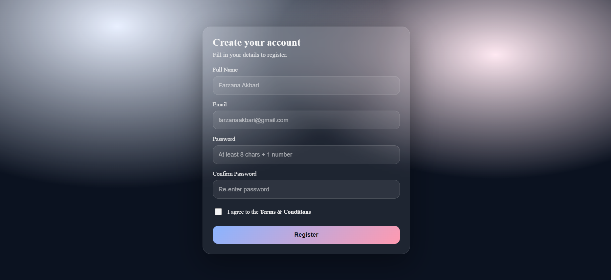

# React Hook Form + Yup Register Form

Simple registration form built with React Hook Form and Yup validation.

---

## How to Run

```bash
npm install
npm run dev
```

Open in browser:

```
http://localhost:5173
```

---

## Features

* React Hook Form
* Yup validation
* Error messages
* Confirm password check
* Required Terms checkbox
* Success message on submit

---


 ##  Output

 

---

##  Tech

* React (Vite)
* React Hook Form
* Yup

---

## 👩‍💻 Author

Farzana Akbari ❤️
